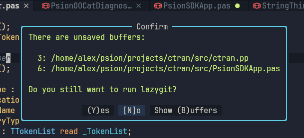

# lazygit-confirm.nvim

A tiny plugin to check if there are any unsaved buffers before running [Snacks](https://github.com/folke/snacks.nvim).lazygit.



## Why?

I use Snacks.lazygit regularly to launch lazygit in a NeoVim window by using `<leader>gg`.
However, I kept forgetting to save all my work before running lazygit.
I would commit my changes, realise that I hadn't saved everything, and then have to amend my last commit.

## Usage

For Lazy.nvim:
```lua
return {
  {
    "thelastpsion/lazygit-confirm.nvim",
  },
}
```

In `keymaps.lua` (if using LazyVim):
```lua
keymap.set("n", "<leader>gg", function()
  require("lazygit-confirm").confirm()
end, { noremap = true })
```


